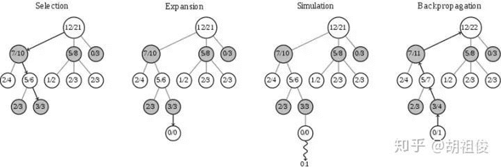

# 实验报告
## 概述

----------------------------------------------
        五子棋是我的第一个实践项目，让我学会了棋类博弈的许多知识，比如蒙特卡洛树搜索以及alpha-beta剪枝算法。
    同时我复习并巩固了许多c++的基本知识，在基础项目完成之后还结合自身情况自学了一点点神经网络（还没完全搞懂），
    并且将其运用到五子棋的评估中。

## 我究竟学到了什么

----------------------------------------------
        1.最最最重要的，提升了debug的熟练程度。完成这个项目时除了查资料就是在debug，相比之下“写”代码的时间反而很少。
        2.具备一定的工程意识。高中时期无论代码多乱只要能跑就是胜利，但是一个大型工程肯定不能这样乱成一锅粥。我学会了
    要规范的给函数还有各个文件命名，并且将函数分类下放到各个文件中去，以及函数的封装等等。
        3.自学了一点点神经网络。对NN以及进阶版的CNN还有reinforment learning有一定的了解，将alphazero官方版（通用）
    更改为五子棋版本并训练。
        4.学会了alpha-beta剪枝和蒙特卡洛数搜索的基本运用。

## 具体实现

----------------------------------------------
        1，第一代。没有参考任何资料，通过判断棋型来估值并使用贪心算法。具体就是遍历整个棋盘的空位，假设在这个空位落子，
    再根据棋形评估整个棋盘的分数，最后在分数最高的位置落子。这个ai速度快的惊人，当然棋力也低的惊人，本人6：4勉强胜过该
    ai。
```c++
    // 自己
	a[i][j].value = color; // 尝试下在这里
    for (int k = 0; k < 4; k++)
    {
        //计算分数
    }
    // 敌人（原理同上，已略）
    
    if (a[i][j].number == MAXnumber[0])
    {
        // 如果和最高分数相同
        MAXnumber[number] = a[i][j].number;
        MAXy[number] = i;
        MAXx[number] = j;
        number++;
        // 新增一个分数及坐标
    }
    if (BOX[i][j].number > MAXnumber[0])
    {
        // 如果比最高分数高
        for (int k = 0; k < number; k++)
        {
            MAXnumber[k] = 0;
            MAXy[k] = 0;
            MAXx[k] = 0;
        }
        number = 0;
        MAXnumber[number] = BOX[i][j].number;
        MAXy[number] = i;
        MAXx[number] = j;
        number++;
        // 清空数组再加入
    }

```
----------------------------------------------
        2，第二代。加入了game tree dfs，但是仅仅搜索两层就需要30s以上，同时棋力提升也不太明显（虽然已经能干爆我了）。
    同时发现下棋后并不需要评估整个15X15的棋盘，最多只用评估以该位置为原点的11X11。
----------------------------------------------
        3，第三代。查询了大量资料，加入了alpha-beta剪枝，成功地将搜索层数推至6层。Alpha-beta剪枝的核心观点就是，当你
    有两个选择A、B时，此时你知道了B选择不如A选择好，那么你就不需要知道B选择有多坏。那么同样的，轮到对面选择时，同样的A，
    B两个选项，假设对面绝对理性，对于你而言B选择比A选择坏，那么你就不需要知道A选择对你有多好，因为对面不可能选择A。

```c++
int AlphaBeta(int depth, int alpha, int beta)
{ 
    if (depth == 0)
    {		//到达一定深度，评估棋局，返回分值
         val = Evaluate(); 
        return val; 
    }
    while (MovesLeft()) 
    {
        MakeNextMove();		//下棋
        val = -AlphaBeta(depth - 1, -beta, -alpha);
        UnmakeMove();		//撤销
        if (val >= beta) 		//剪枝情况判断 
            return beta;
        if (val > alpha)
            alpha = val;
    }
	return alpha;   // 此时的alpha就是记录了当前结点的所有子结点的最大的负评估值 
}
```
----------------------------------------------
        4，第四代。加入蒙特卡洛树搜索。蒙特卡洛树搜索包括四个过程：选择、扩展、模拟、回溯。首先根据函数
    UCB(v_i )=v_i+c×√(lnN/n_i )得出该节点的UCB值，搜索最大的那个，其中vi是该节点的胜率，c是可调的常数，默认为根号二，
    N为父节点搜索次数，ni为该节点搜索次数。在搜到最底层时，要拓展一个0节点。模拟则是从零节点随即下棋，回溯就是把结果一
    层层提交上去。


```c++
double UCB(chess x,int player)
{
	if(mp[x].b==0)return 0;
	double a1=mp[x].a,b1=mp[x].b;
	if(a1+b1==0)return -inf;
	if(player==1)return a1/b1+sqrt(log(a1+b1)/b1);
	else if(player==0)return -a1/b1+sqrt(log(a1+b1)/b1);
}
chess UCT_search(chess x,pair<int,int> center,int player)
{
	chess y=x;
	chess ans=y;
	if(check_four(y).first)
	{
		pair<int,int> u=check_four(y).second; 
		ans.g[u.first][u.second]=player+1;
		return ans;
	}
	if(check_three(y).first)
	{
		pair<int,int> u=check_three(y).second;
		ans.g[u.first][u.second]=player+1;
		return ans;
	}
	if(mp.find(x)==mp.end())
	{
		init_chess(x);
	}
	int cnt=0;//选择次数 
	while(cnt<=select_num)
	{
		cnt++;
		pair<chess,int> select_point=tree_policy(x,center,1);
		for(int j=1;j<=sta_num;j++)//每个状态多次模拟，增强效果 
		{
			double s=default_policy(select_point.first,select_point.second^1);
			back_up(select_point.first,y,s);
		}
	}
	vector<chess>::iterator it;
	double maxn=UCB(*(mp[y].vec.begin()),player);
	for(it=mp[y].vec.begin();it!=mp[y].vec.end();it++)
	{
		if(UCB(*it,player)>=maxn)
		{
			maxn=UCB(*it,player);
			ans=*it;
		}
	}
	vector<chess>().swap(mp[y].vec);//释放内存 
	return ans;
}
```
----------------------------------------------
        5，第五代。查询蒙特卡洛树搜索时发现deepmind就是使用这个算法下围棋。其实从理论上来说，对于五子棋而言，如果评估、
    函数完美无缺，一层贪心就足以。但是目前做不到，就需要多搜索几层来减小评估算法的误差。同时下棋是一个熵减的过程，多搜
    索几次更有利于评估。那么我们就可以从评估函数入手，对这个ai进行进一步优化。（由于本人才疏学浅，尚不能在c++中实现该
    神经网络，于是转战python，同时由于编译速率变慢，将搜索层数退化为4层）
        源代码改编自alphazero公开的代码。（暂时还没有手搓一个的能力）
        训练过程：硬件使用RTX4060，依靠Theano进行训练。
        最耗时的过程是self-play，保存当前最新模型，self-play数据直接由当前最新模型生成，并用于训练更新自身。其本质为
    左右互搏，只不过一方加入MCTS，另一方纯网络。同时为了提高数据的运用以及时间，由于围棋具有旋转和镜像翻转等价的性质，
    因此每一局self-play结束后，把这一局的数据进行旋转和镜像翻转，将8种等价情况的数据全部存入self-play的data buffer中。
    这种旋转和翻转的数据扩充在一定程度上也能提高self-play数据的多样性和均衡性。
    接着是策略价值网络训练。策略价值网络就是在给定当前局面的情况下，返回当前局面下每一个可行action的概率以及当前局面评分
    的模型。前面self-play收集到的数据就是用来训练策略价值网络的，而训练更新的策略价值网络也会马上被应用到MCTS中进行后面
    的self-play，以生成更优质的self-play数据。两者相互嵌套，相互促进，就构成了整个训练的循环。

```c++
def start_self_play(self, player, is_shown=0, temp=1e-3):
        self.board.init_board()
        p1, p2 = self.board.players
        states, mcts_probs, current_players = [], [], []

        while True:
            # ======通过get_action，把当前state放入，预测move和概率的列表
            move, move_probs = player.get_action(self.board,temp=temp,return_prob=1)

            # ======存储s，move_probs，player
            states.append(self.board.current_state())
            mcts_probs.append(move_probs)
            current_players.append(self.board.current_player)

            # ======执行动作
            self.board.do_move(move)
            if is_shown:
                self.graphic(self.board, p1, p2)

            # ======是否结束
            end, winner = self.board.game_end()
            if end:
                winners_z = np.zeros(len(current_players))
                if winner != -1:
                    winners_z[np.array(current_players) == winner] = 1.0
                    winners_z[np.array(current_players) != winner] = -1.0

                # 重置玩家
                player.reset_player()

                #show文字
                if is_shown:
                    if winner != -1:
                        print("Game end. Winner is player:", winner)
                    else:
                        print("Game end. Tie")
                return winner, zip(states, mcts_probs, winners_z)
```
        由此训练3000局，耗时一天，最后以10：0完爆第四代ai。

## 总结

        在做这个项目时完全是边做边学。我学到了很多新的知识同时夯实了自己的基础，为以后学习更多算法打下基础。由于本人学艺不精
    且才刚刚起步，期待各位大佬的建议！
        很多数据都来自一个五子棋网站www.renju.net